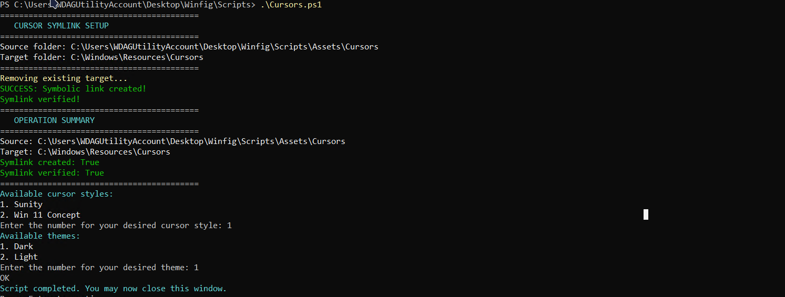
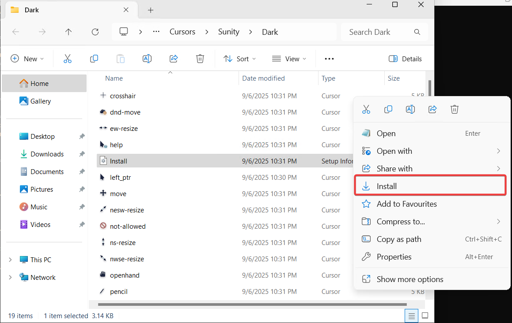
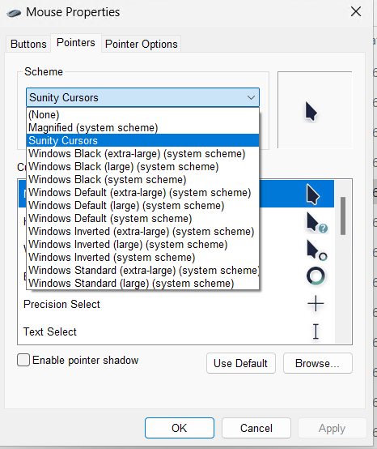
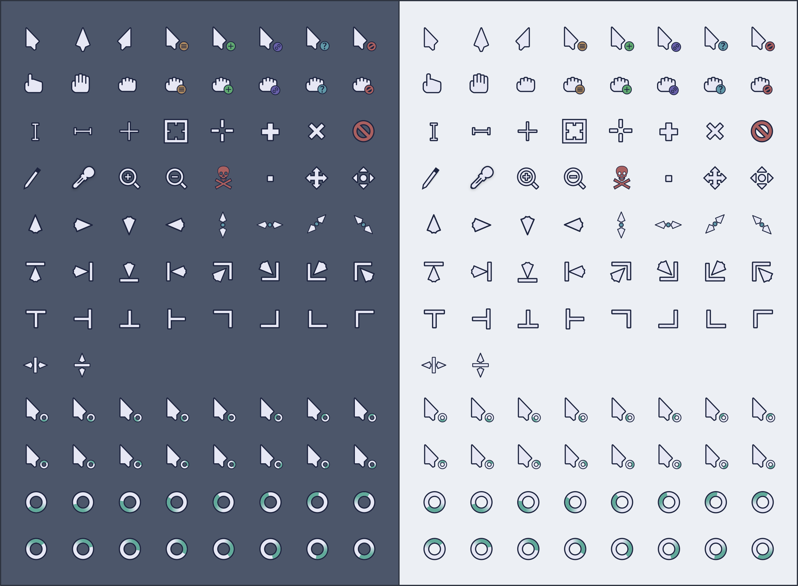
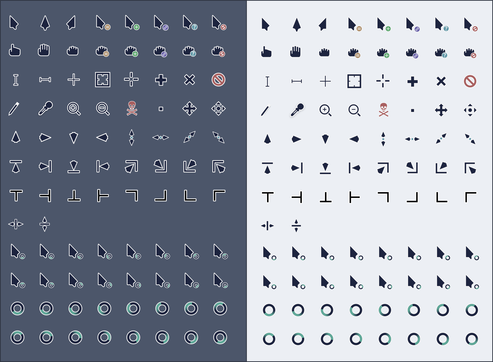

# Cursor.ps1 Usage Guide

## Overview
This guide explains how to use the `Cursor.ps1` PowerShell script to set up and install custom Windows cursors from the Winfig project. The script allows you to select between different cursor styles and themes, and guides you through the installation process.

---

## Features
- Choose between multiple cursor styles (e.g., Sunity, Win 11 Concept)
- Select Light or Dark theme for each style
- Automatically creates a symbolic link to the Windows Cursors directory
- Opens the selected cursor folder in Explorer for easy installation
- Displays step-by-step instructions in a message box

---

## Prerequisites
- Windows operating system
- Administrator privileges (required for symlink creation and installation)
- PowerShell 5.1 or newer

---

## Step-by-Step Installation Guide

### 1. Run the Script & Select Theme
Right-click `Cursor.ps1` and select **Run with PowerShell as Administrator**.

### 2. Select Cursor Style
When prompted, enter the number for your desired cursor style:
Choose between **Light** or **Dark** theme when prompted:

### 3. Run Install Script
After selecting the theme, the script will open the corresponding folder in Explorer and run the install script.

### 4. Select Desired Cursor Style
Choose from the available cursor styles below:

### 5. Complete Setup
Apply selected cursor style by following the instructions.

---
## Available Cursor Styles

#### Sunity - Light

#### Sunity - Dark

#### Win 11 Concept - Light/Dark

---

## Troubleshooting
- If you do not see the cursor style you want, ensure the folders are present in `Assets/Cursors`.
- Make sure you run the script as administrator.
- If the symbolic link fails, check for existing files in `C:\Windows\Resources\Cursors` and remove them manually if needed.

---

## Credits
Created by Armoghan-ul-Mohmin

---

## License
See main project LICENSE file.
