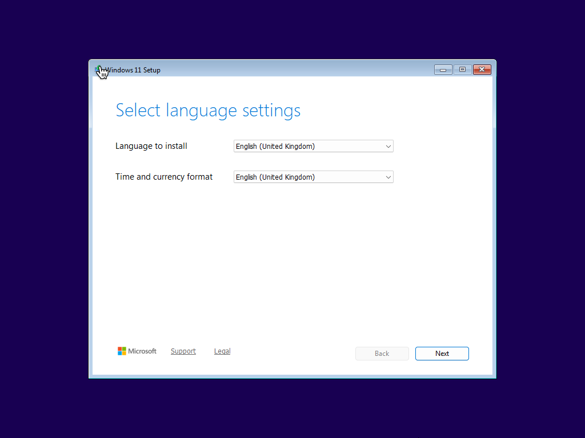
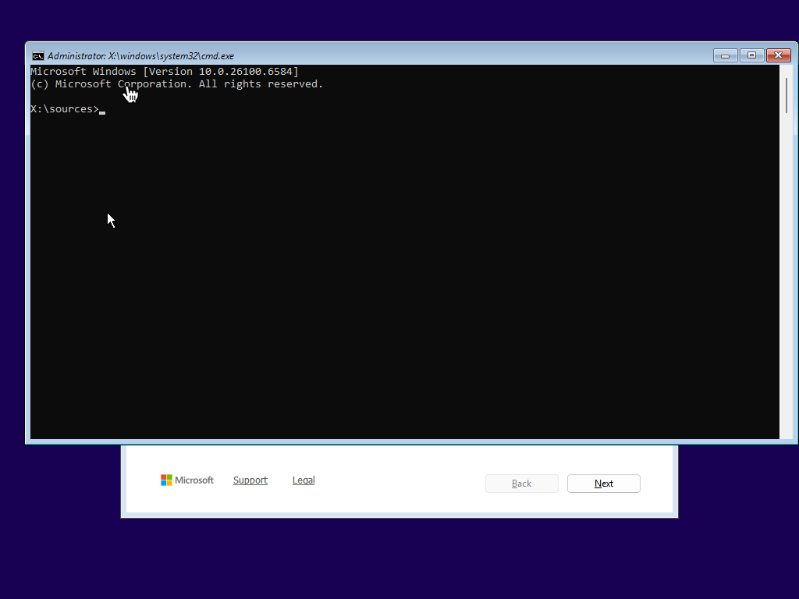
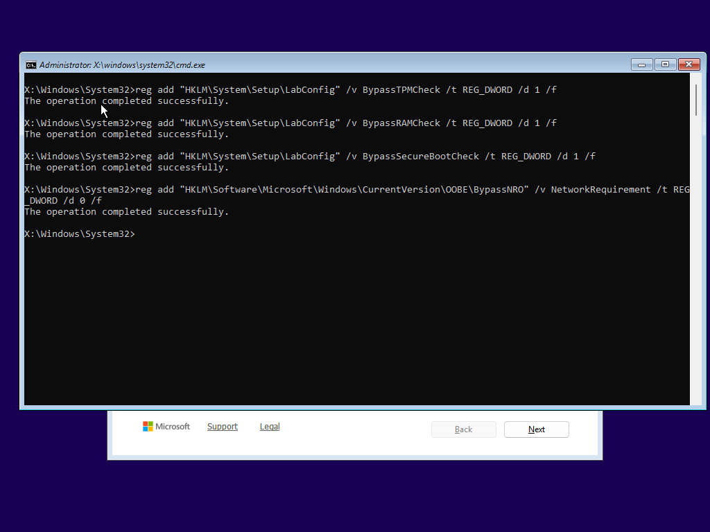
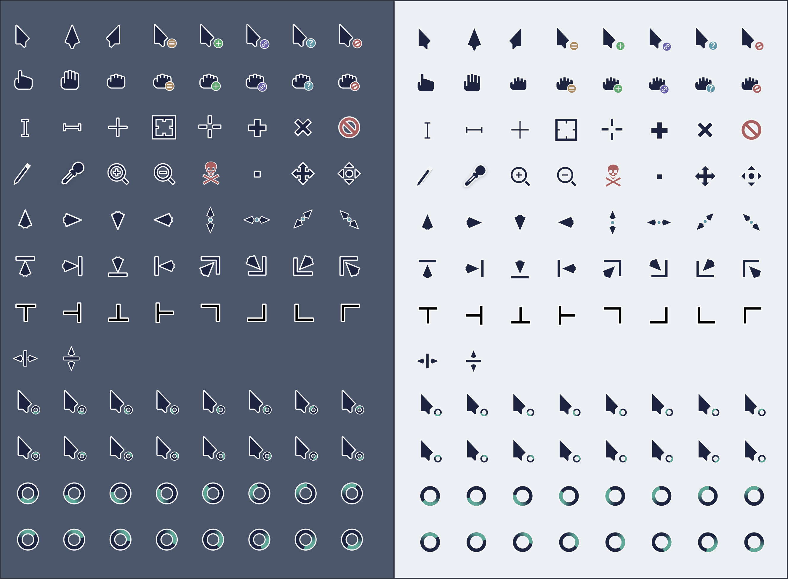
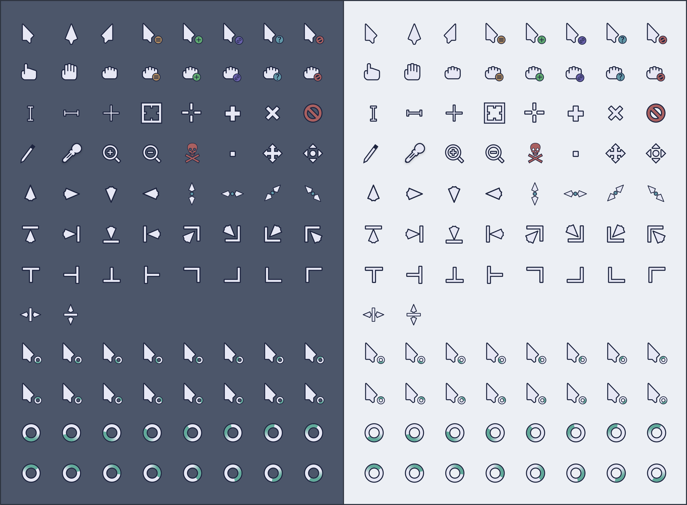
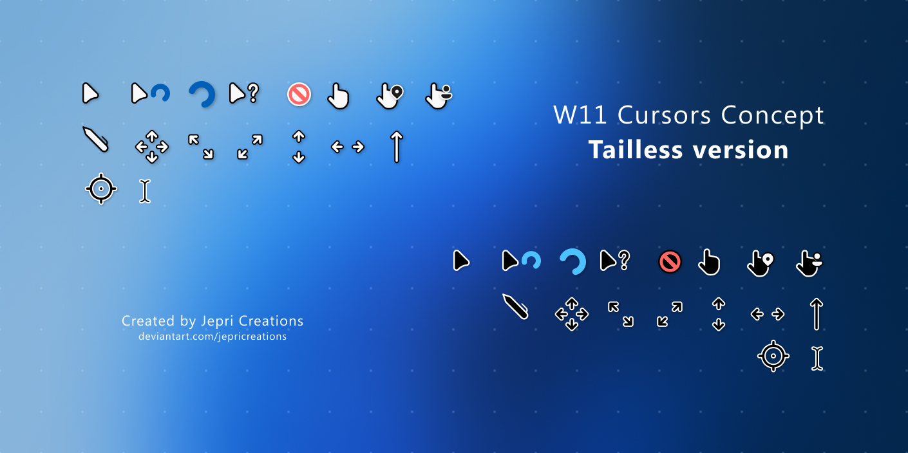
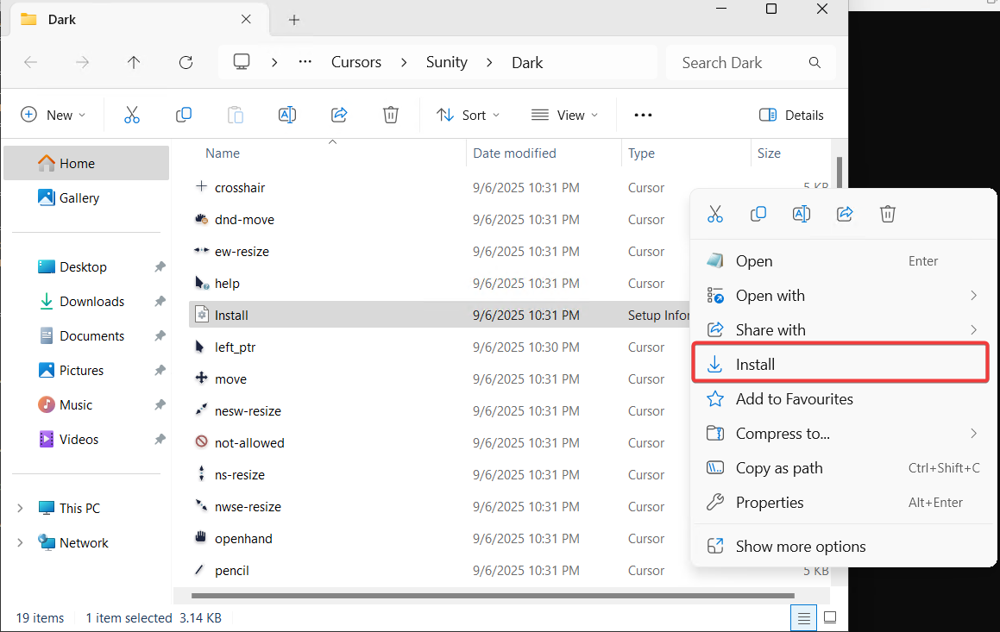
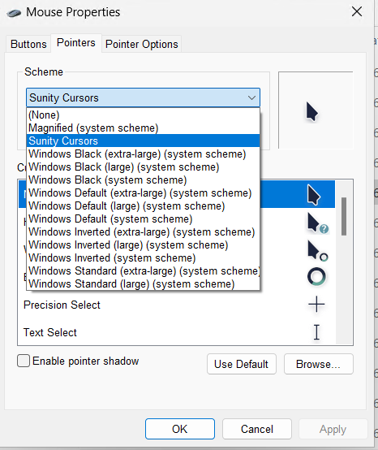

<div align="center">

# 🔧 Winfig

**The Ultimate Windows 11 Configuration Toolkit**

[](https://opensource.org/licenses/MIT)
[](https://github.com/PowerShell/PowerShell)
[](https://www.microsoft.com/windows)
[](https://github.com/Armoghan-ul-Mohmin/Winfig)

[](https://github.com/Armoghan-ul-Mohmin/Winfig/issues)
[](https://github.com/Armoghan-ul-Mohmin/Winfig/stargazers)
[](https://github.com/Armoghan-ul-Mohmin/Winfig/network/members)
[](https://github.com/Armoghan-ul-Mohmin/Winfig/commits/main)

---

**Complete Windows 11 configuration ecosystem for clean installations and enterprise-ready development environments**

*Bypass installation requirements • Remove bloatware • Optimize system performance • Install developer fonts • Apply custom cursors • Setup development tools • Enterprise bootstrap system*

</div>

## Table of Contents
- [Key Features](#-key-features)
- [Windows 11 Installation Bypass](#️-windows-11-installation-bypass)
  - [Quick Installation Guide](#-quick-installation-guide)
    - [Registry Method](#️-registry-method)
- [Windows 11 Debloating Script](#-windows-11-debloating-script)
  - [Quick Start](#-quick-start)
  - [Debloat Features](#-debloat-features)
  - [Registry Optimizations](#️-registry-optimizations)
  - [Advanced Tool Integration](#️-advanced-tool-integration)
  - [Usage Examples](#-usage-examples)
- [Winfig Bootstrap System](#️-winfig-bootstrap-system)
  - [Bootstrap Features](#-bootstrap-features)
  - [Bootstrap Workflow](#-bootstrap-workflow)
  - [Execution Methods](#️-execution-methods)
  - [Safety Features](#️-safety-features)
- [Font Installation System](#️-font-installation-system)
  - [Supported Fonts](#-supported-fonts)
  - [Installation Features](#️-installation-features)
  - [Usage Examples](#-usage-examples-1)
- [Cursor Installation System](#️-cursor-installation-system)
  - [Available Cursor Themes](#-available-cursor-themes)
  - [Installation Process](#️-installation-process)
  - [Usage Guide](#-usage-guide)
- [Complete Setup Guide](#-complete-setup-guide)
  - [Recommended Script Sequence](#-recommended-script-sequence)
  - [Alternative Workflows](#️-alternative-workflows)
  - [Execution Timeline](#️-execution-timeline)
- [Troubleshooting Failed Installations](#troubleshooting-failed-installations)
- [Contributing](#contributing)
  - [Development Workflow](#development-workflow)
  - [Contribution Standards](#contribution-standards)
- [Disclaimer](#️-disclaimer)
- [License](#-license)

## ⭐ Key Features

<table>
<tr>
<td width="50%">

### 🚀 Installation Tools
- **Hardware Bypass** - Skip TPM 2.0, RAM, and Secure Boot checks
- **Account Freedom** - Create local accounts without Microsoft Account
- **OOBE Customization** - Bypass Out-Of-Box Experience restrictions

### 🧹 System Cleanup
- **52+ App Removal** - Comprehensive bloatware elimination
- **Professional Fonts** - Developer-grade font installation
- **Custom Cursors** - Modern cursor theme installation
- **Safe Execution** - Only removes existing applications
- **Error Handling** - Graceful failure recovery

</td>
<td width="50%">

### ⚙️ System Optimization
- **15+ Registry Tweaks** - Performance and privacy enhancements
- **Dark Mode Setup** - System-wide theme configuration
- **Explorer Enhancements** - Show hidden files and extensions

### 🔧 Advanced Integration
- **Winutil Support** - Chris Titus Tech tool integration
- **Bootstrap System** - Enterprise development environment setup
- **Font Management** - Professional font installation system
- **Cursor Theming** - Modern cursor installation and management
- **Package Manager Integration** - Chocolatey + Winget automation
- **Git Integration** - Automatic version control setup
- **Custom Presets** - Pre-configured optimization profiles
- **Cross-Version Compatible** - PowerShell 5.1 and 7.x support

</td>
</tr>
</table>

## 🖥️ Windows 11 Installation Bypass

> **Bypass hardware requirements during Windows 11 installation**

<div align="center">

| Step | Action | Result |
|------|--------|---------|
| 1️⃣ | Boot from installation media | Language selection screen |
| 2️⃣ | Press `Shift + F10` | Command prompt opens |
| 3️⃣ | Execute registry commands | Bypass requirements set |
| 4️⃣ | Continue installation | Local account available |

</div>

### 📋 Quick Installation Guide

Follow these steps during Windows 11 installation to bypass system requirements:

#### 🔧 Registry Method

1. **Boot from Windows 11 Install Media**
   - Boot off your Windows 11 installation disk
   - The first screen should ask you to choose the installation language

   

2. **Open Command Prompt**
   - Press `Shift + F10` to open a command prompt window during setup

   

3. **Execute Registry Commands**

   Copy and paste the following commands **one by one** in the command prompt:

   <details>
   <summary><strong>📋 Individual Commands (Click to expand)</strong></summary>

   **Bypass TPM 2.0 Requirement**
   ```batch
   reg add "HKLM\SYSTEM\Setup\LabConfig" /v BypassTPMCheck /t REG_DWORD /d 1 /f
   ```

   **Bypass RAM Requirement Check**
   ```batch
   reg add "HKLM\SYSTEM\Setup\LabConfig" /v BypassRAMCheck /t REG_DWORD /d 1 /f
   ```

   **Bypass Secure Boot Check**
   ```batch
   reg add "HKLM\SYSTEM\Setup\LabConfig" /v BypassSecureBootCheck /t REG_DWORD /d 1 /f
   ```

   **Bypass Microsoft Account Requirement**
   ```batch
   reg add "HKLM\SOFTWARE\Microsoft\Windows\CurrentVersion\OOBE\BypassNRO" /v NetworkRequirement /t REG_DWORD /d 0 /f
   ```
   </details>

   **🚀 One-Line Command (Recommended)**
   ```batch
   reg add "HKLM\SYSTEM\Setup\LabConfig" /v BypassTPMCheck /t REG_DWORD /d 1 /f && reg add "HKLM\SYSTEM\Setup\LabConfig" /v BypassRAMCheck /t REG_DWORD /d 1 /f && reg add "HKLM\SYSTEM\Setup\LabConfig" /v BypassSecureBootCheck /t REG_DWORD /d 1 /f && reg add "HKLM\SOFTWARE\Microsoft\Windows\CurrentVersion\OOBE\BypassNRO" /v NetworkRequirement /t REG_DWORD /d 0 /f
   ```

   

4. **Complete Installation**
   - All bypass settings are now configured
   - Continue with the Windows 11 installation normally
   - You can now create a local account without Microsoft Account requirements

## 🧹 Windows 11 Debloating Script

> **Transform your fresh Windows 11 installation into a clean, optimized system**

<div align="center">

**🎯 One Script • Four Functions • Complete Solution**

| Component | Description | Impact |
|-----------|-------------|---------|
| **Debloater** | Removes 52+ unwanted apps | Clean system |
| **Registry Optimizer** | Applies 15+ performance tweaks | Enhanced speed |
| **Winutil Integrator** | Launches advanced configuration | Professional setup |
| **Bootstrap Launcher** | Complete development environment | Enterprise-ready |

</div>

### 🚀 Quick Start

```powershell
# Run directly from web (Recommended)
Invoke-RestMethod -Uri "https://raw.githubusercontent.com/Armoghan-ul-Mohmin/Winfig/main/Debloat.ps1" | Invoke-Expression

# Or download and run locally
.\Debloat.ps1
```

### 📱 Debloat Features

<details>
<summary><strong>🎯 52+ Applications Removed (Click to expand)</strong></summary>

<table>
<tr>
<td width="50%">

**Social Media & Third-Party**
- Instagram
- LinkedIn
- Spotify
- Disney+
- Facebook integrations

**Microsoft Entertainment**
- Xbox Gaming Suite
- Xbox Console Companion
- Xbox Game Overlay
- Solitaire Collection
- Movies & TV

**Productivity Bloat**
- Microsoft Teams (Personal)
- Skype
- Clipchamp
- Paint 3D
- 3D Viewer

</td>
<td width="50%">

**System Apps**
- Cortana
- Widgets
- Voice Recorder
- Snipping Tool
- Camera
- Maps
- Alarms & Clock

**Microsoft Services**
- Weather
- News
- Get Help
- Feedback Hub
- Tips App
- Sticky Notes

**Developer Tools**
- Power Automate Desktop
- Dev Home
- Mixed Reality Portal
- Quick Assist

</td>
</tr>
</table>

</details>

### ⚙️ Registry Optimizations

<div align="center">

**🎛️ 15+ Performance & Privacy Tweaks**

</div>

<table>
<tr>
<td width="33%">

**🎨 Theme & Interface**
- Dark Mode (System-wide)
- Hide Task View Button
- Hide Widgets Button
- Show File Extensions
- Show Hidden Files

</td>
<td width="33%">

**🔒 Privacy & Search**
- Disable Bing Search
- Hide Recommendations
- Remove Telemetry
- Location Tracking Off
- Disable Activity History

</td>
<td width="34%">

**🚀 Performance & System**
- Verbose Boot Messages
- Enhanced Mouse Precision
- Sticky Keys Disabled
- BSOD Technical Details
- Explorer Optimizations

</td>
</tr>
</table>

### 🔧 Advanced Tool Integration

<div align="center">

**🤝 Seamless Integration with Professional Configuration Tools**

</div>

#### 🛠️ Chris Titus Tech Winutil Integration

| Feature | Description | Benefit |
|---------|-------------|---------|
| **Auto Download** | Fetches custom preset configuration | No manual setup |
| **Desktop Placement** | Saves `Winutil.json` for easy access | Quick import |
| **Guided Setup** | Clear instructions for importing presets | User-friendly |
| **One-Click Launch** | Automatically opens Winutil tool | Effortless transition |

#### 🚀 Winfig Bootstrap Integration

<div align="center">

**🏗️ Complete Development Environment Setup**

</div>

| Component | Functionality | Developer Benefit |
|-----------|---------------|-------------------|
| **Environment Validation** | System compatibility checks | Safe execution |
| **Package Manager Setup** | Chocolatey + Winget installation | Automated dependency management |
| **Git Integration** | Version control system setup | Code repository access |
| **Repository Cloning** | Automatic Winfig toolkit download | Complete offline access |
| **System Restore** | Automatic backup point creation | Safe rollback capability |

<details>
<summary><strong>📋 Preset Configuration Features</strong></summary>

- **System Tweaks**: Advanced registry optimizations
- **Service Management**: Optimized Windows services
- **Privacy Enhancements**: Comprehensive telemetry blocking
- **Performance Tweaks**: CPU and memory optimizations
- **Security Hardening**: Enhanced system protection
- **Network Optimization**: Improved connectivity settings

</details>

### 💻 Usage Examples

<div align="center">

**Choose Your Preferred Execution Method**

</div>

#### 🌐 Method 1: Direct Web Execution (Recommended)
```powershell
Invoke-RestMethod -Uri "https://raw.githubusercontent.com/Armoghan-ul-Mohmin/Winfig/main/Debloat.ps1" | Invoke-Expression
```
> **Advantages**: Always gets the latest version • No manual downloads • Single command execution

#### 📁 Method 2: Local Download & Execute
```powershell
# Download the script first
Invoke-WebRequest -Uri "https://raw.githubusercontent.com/Armoghan-ul-Mohmin/Winfig/main/Debloat.ps1" -OutFile "Debloat.ps1"

# Then execute locally
.\Debloat.ps1
```
> **Advantages**: Offline execution • Script inspection before running • Version control

#### 🏗️ Method 3: Complete Bootstrap Setup
```powershell
# Launch comprehensive development environment setup
Invoke-RestMethod -Uri "https://raw.githubusercontent.com/Armoghan-ul-Mohmin/Winfig/main/bootstrap.ps1" | Invoke-Expression
```
> **Advantages**: Full toolkit installation • Development environment setup • Repository cloning • System backup

## 🏗️ Winfig Bootstrap System

> **Enterprise-grade Windows development environment configuration platform**

<div align="center">

**🎯 Complete System Transformation in One Command**

</div>

The Winfig Bootstrap system provides a comprehensive solution for setting up a complete Windows development environment. This enterprise-grade toolkit automatically configures your system with essential tools, package managers, and development utilities.

### 🚀 Bootstrap Features

<table>
<tr>
<td width="50%">

**🔍 System Validation**
- Administrator privilege verification
- Windows 10/11 compatibility check
- PowerShell version validation
- Internet connectivity testing
- Disk space requirements
- Execution policy verification

**🛠️ Tool Installation**
- Chocolatey package manager
- Windows Package Manager (Winget)
- Git version control system
- Automatic PATH configuration

</td>
<td width="50%">

**🔒 Safety & Backup**
- System restore point creation
- Environment validation
- Error handling & recovery
- Detailed logging system
- Safe rollback capabilities

**� Repository Management**
- Automatic Winfig cloning
- Version control setup
- Local toolkit access
- Offline functionality

</td>
</tr>
</table>

### 📋 Bootstrap Workflow

<div align="center">

| Phase | Process | Duration | Description |
|-------|---------|----------|-------------|
| **1️⃣ Validation** | Environment Check | 30s | System compatibility verification |
| **2️⃣ Backup** | Restore Point | 60s | Create system recovery checkpoint |
| **3️⃣ Prerequisites** | Package Managers | 2-5min | Install Chocolatey, Winget, Git |
| **4️⃣ Repository** | Clone Winfig | 30s | Download complete toolkit locally |
| **5️⃣ Completion** | Summary & Cleanup | 15s | Final status and log generation |

**⏱️ Total Time: ~4-7 minutes** (depending on internet speed)

</div>

### 🎛️ Execution Methods

#### 🌐 Direct Web Launch (Recommended)
```powershell
Invoke-RestMethod -Uri "https://raw.githubusercontent.com/Armoghan-ul-Mohmin/Winfig/main/bootstrap.ps1" | Invoke-Expression
```

#### 📁 Through Debloat Script Integration
```powershell
# Run Debloat script - Bootstrap option appears after completion
Invoke-RestMethod -Uri "https://raw.githubusercontent.com/Armoghan-ul-Mohmin/Winfig/main/Debloat.ps1" | Invoke-Expression
```

### �🛡️ Safety Features

<div align="center">

| Safety Measure | Description | Protection Level |
|----------------|-------------|------------------|
| **Existence Check** | Only removes apps if installed | 🟢 High |
| **Error Handling** | Graceful failure recovery | 🟢 High |
| **Progress Feedback** | Real-time status updates | 🟡 Medium |
| **Compatibility** | PowerShell 5.1 and 7.x support | 🟢 High |
| **Registry Validation** | Safe registry key creation | 🟢 High |
| **System Restore** | Automatic backup point creation | 🟢 High |
| **Administrator Check** | Elevated privileges verification | 🟢 High |

</div>

## 🔤 Font Installation System

> **Professional font management for development environments**

<div align="center">

**🎯 Developer-Grade Fonts • System-Wide Installation • Registry Management**

</div>

The Font Installation System provides automated installation of essential development fonts with proper Windows registry integration and font cache management.

### 📝 Supported Fonts

<div align="center">

| Font Family | File Size | Features | Use Case |
|-------------|-----------|----------|----------|
| **Hack Nerd Font** | ~100MB | Powerline glyphs, Programming ligatures | Terminal, Code editors |
| **JetBrains Mono** | ~80MB | Enhanced readability, Modern design | IDEs, Text editors |

</div>

<details>
<summary><strong>🔍 Font Features Details</strong></summary>

**Hack Nerd Font:**
- Complete Nerd Font icon collection (3,000+ glyphs)
- Powerline symbols for enhanced terminal experience
- Multiple weights (Regular, Bold, Italic, Bold Italic)
- Optimized for programming and terminal applications

**JetBrains Mono:**
- Designed specifically for developers
- Increased height for better readability
- Clear distinction between similar characters (0/O, 1/l/I)
- Professional appearance for code presentation

</details>

### ⚙️ Installation Features

<table>
<tr>
<td width="50%">

**🔧 Installation Options**
- System-wide installation (default)
- Per-user installation option
- Administrator privilege handling
- Force reinstall capability
- Automatic ZIP extraction

**🛡️ Safety & Management**
- Font existence verification
- Registry validation and cleanup
- Font cache refresh automation
- Backup and rollback support

</td>
<td width="50%">

**🎯 Technical Features**
- Multiple font format support (TTF, OTF, TTC)
- Recursive ZIP file processing
- Windows font folder management
- Registry-based font registration
- Service restart for cache refresh

**📊 Progress Tracking**
- Real-time installation feedback
- Detailed error reporting
- Installation summary statistics
- Font verification confirmation

</td>
</tr>
</table>

### 💻 Usage Examples

<div align="center">

**Choose Your Installation Method**

</div>

#### 🌐 Method 1: Direct Execution (Requires Assets)
```powershell
# Run from local repository (after cloning)
.\Install-Fonts.ps1

# With custom parameters
.\Install-Fonts.ps1 -SystemWide $true -ForceReinstall $true
```

#### 📁 Method 2: Custom Font Selection
```powershell
# Install specific fonts only
.\Install-Fonts.ps1 -FontZips @("Hack.zip") -SystemWide $true

# Per-user installation
.\Install-Fonts.ps1 -SystemWide $false -ForceReinstall $false
```

#### 🔧 Method 3: Advanced Configuration
```powershell
# Custom source folder and selective installation
.\Install-Fonts.ps1 -FontZips @("JetBrainsMono.zip") -SourceFolder "C:\CustomFonts" -SystemWide $true -ForceReinstall $true
```

### 🎯 Installation Parameters

<div align="center">

| Parameter | Type | Default | Description |
|-----------|------|---------|-------------|
| **FontZips** | String Array | `@("Hack.zip", "JetBrainsMono.zip")` | Font ZIP files to install |
| **SourceFolder** | String | `Assets` folder | Location of font ZIP files |
| **SystemWide** | Switch | `$true` | Install fonts system-wide |
| **ForceReinstall** | Switch | `$true` | Reinstall existing fonts |

</div>

### 🛡️ Requirements & Permissions

<div align="center">

| Requirement | System-Wide | Per-User | Note |
|-------------|-------------|----------|------|
| **Administrator** | ✅ Required | ❌ Not needed | UAC elevation prompt |
| **Font Assets** | ✅ Required | ✅ Required | ZIP files in Assets folder |
| **PowerShell** | 5.1+ | 5.1+ | Windows PowerShell or PowerShell Core |
| **Windows Version** | 10/11 | 10/11 | Modern font management APIs |

</div>

## 🖱️ Cursor Installation System

> **Modern cursor themes for enhanced Windows experience**

<div align="center">

**🎯 Professional Cursors • Interactive Installation • Symlink Management**

</div>

The Cursor Installation System provides automated setup of modern cursor themes with Windows system integration and interactive installation guidance.

### 🎨 Available Cursor Themes

<div align="center">

**🖱️ Professional Cursor Collections for Enhanced Windows Experience**

*Choose from modern, carefully crafted cursor themes designed for productivity and style*

</div>

---

#### 🌟 **Sunity Theme Collection**

<div align="center">

**Modern • Clean • Professional**

| Dark Variant | Light Variant |
|:------------:|:-------------:|
|  |  |
| *Perfect for dark mode enthusiasts* | *Ideal for light interface users* |

</div>

<table>
<tr>
<td width="25%">

**� Design Focus**
- Minimalist aesthetics
- Sharp, clean lines
- Consistent iconography
- Smooth transitions

</td>
<td width="25%">

**✨ Key Features**
- Fluid animations
- High contrast visibility
- Ergonomic pointer design
- Universal compatibility

</td>
<td width="25%">

**🎨 Visual Style**
- Contemporary design
- Subtle shadow effects
- Balanced proportions
- Professional appearance

</td>
<td width="25%">

**🏢 Best Use Cases**
- Office environments
- Development work
- Daily productivity
- Extended usage sessions

</td>
</tr>
</table>

---

#### 💎 **Win 11 Concept Theme Collection**

<div align="center">

**Modern • Refined • Windows 11 Inspired**

| Theme Preview |
|:-------------:|
|  |
| *Available in both Dark and Light variants* |

</div>

<table>
<tr>
<td width="25%">

**🎯 Design Focus**
- Windows 11 aesthetic
- Fluent design principles
- Modern cursor shapes
- Consistent with OS theme

</td>
<td width="25%">

**✨ Key Features**
- Crisp pixel-perfect design
- Enhanced visibility
- Smooth cursor tracking
- Native Windows feel

</td>
<td width="25%">

**🎨 Visual Style**
- Microsoft design language
- Subtle transparency effects
- Rounded corner elements
- Contemporary appearance

</td>
<td width="25%">

**🏢 Best Use Cases**
- Windows 11 systems
- Modern interfaces
- Gaming environments
- Creative applications

</td>
</tr>
</table>

<div align="center">

---

**💡 Pro Tip**: Both themes support Dark and Light variants that automatically adapt to your system theme preferences

**🎯 Installation**: Interactive script guides you through theme and variant selection

---

</div>

### ⚙️ Installation Process

<div align="center">

**🔧 Automated Symlink Creation & Interactive Installation**

</div>

<table>
<tr>
<td width="50%">

**🛠️ Technical Features**
- Symbolic link creation to Windows cursor directory
- Administrator privilege handling
- Interactive theme and variant selection
- Automatic Explorer folder opening
- Built-in installation instructions

**🎯 User Experience**
- Step-by-step guided installation
- Visual theme preview
- One-click folder access
- MessageBox instruction display
- Safe fallback options

</td>
<td width="50%">

**🔧 System Integration**
- Windows cursor directory management (`C:\Windows\Resources\Cursors`)
- Proper symlink validation and verification
- Force remove existing installations
- Registry-based cursor registration
- System-wide cursor availability

**🛡️ Safety & Validation**
- Administrator privilege verification
- Source folder existence checking
- Symlink integrity validation
- Error handling with user feedback
- Safe removal of existing installations

</td>
</tr>
</table>

### 💻 Usage Guide

<div align="center">

**Follow these simple steps to install custom cursors**

</div>

#### 🚀 Step 1: Run the Installation Script
```powershell
# Navigate to your Winfig repository
cd "C:\Users\$env:USERNAME\Documents\Winfig"

# Run the cursor installation script (requires admin privileges)
.\Cursors.ps1
```

#### 🎨 Step 2: Choose Your Cursor Theme
The script will present you with available options:


*Interactive cursor theme selection*

**Available Options:**
1. **Sunity** - Modern, clean cursor design
2. **Win 11 Concept** - Windows 11 inspired cursors

#### 🌓 Step 3: Select Theme Variant
Choose between Dark and Light variants:


*Theme variant selection interface*

**Variant Options:**
1. **Dark** - Perfect for dark mode users
2. **Light** - Ideal for light mode interfaces

#### 🖱️ Step 4: Complete Installation
1. **Automatic folder opening** - The script opens the selected cursor folder
2. **Right-click on `Install.inf`** - Select "Install" from context menu
3. **Follow Windows prompts** - Complete the cursor installation
4. **Apply changes** - Cursors become available system-wide

### 🎛️ Advanced Usage

<div align="center">

| Parameter | Type | Default | Description |
|-----------|------|---------|-------------|
| **SourceFolder** | String | `Assets/Cursors` | Location of cursor theme folders |
| **TargetFolder** | String | `C:\Windows\Resources\Cursors` | Windows cursor directory |
| **Force** | Switch | `$true` | Remove existing installations |

</div>

#### 🔧 Custom Parameters
```powershell
# Custom source folder
.\Cursors.ps1 -SourceFolder "C:\CustomCursors" -Force $true

# Different target location
.\Cursors.ps1 -TargetFolder "C:\CustomTarget" -Force $false
```

### 🎯 Installation Requirements

<div align="center">

| Requirement | Status | Description |
|-------------|---------|-------------|
| **Administrator Rights** | ✅ Required | Needed for system folder access |
| **PowerShell 5.1+** | ✅ Required | Windows PowerShell or PowerShell Core |
| **Cursor Assets** | ✅ Required | Theme files in Assets/Cursors folder |
| **Windows 10/11** | ✅ Required | Modern cursor management support |

</div>

### 🛡️ Safety Features

<div align="center">

**Built-in protections for safe cursor installation**

</div>

- **✅ Administrator Verification** - Ensures proper permissions before execution
- **✅ Source Validation** - Confirms cursor assets exist before processing
- **✅ Symlink Verification** - Validates symbolic link creation success
- **✅ Error Handling** - Graceful failure recovery with user guidance
- **✅ Force Removal** - Safe cleanup of existing cursor installations

## 🎯 Complete Setup Guide

<div align="center">

**🚀 From Fresh Windows Installation to Professional Development Environment**

*The definitive guide to transform your Windows 11 system using the complete Winfig toolkit*

</div>

### � Recommended Script Sequence

<div align="center">

**📋 Follow this exact order for optimal results**

</div>

<table>
<tr>
<td width="25%">

**�️ Phase 1: Installation**
1. **Windows 11 Bypass**
   - Boot from install media
   - Execute registry commands
   - Complete installation

</td>
<td width="25%">

**🧹 Phase 2: System Cleanup**
1. **Debloat Script**
   - Remove bloatware apps
   - Apply registry tweaks
   - Optimize performance

</td>
<td width="25%">

**🏗️ Phase 3: Development**
1. **Bootstrap System**
   - Install package managers
   - Setup Git environment
   - Clone repositories

</td>
<td width="25%">

**🔤 Phase 4: Fonts**
1. **Font Installation**
   - Install development fonts
   - Configure system fonts
   - Refresh font cache

</td>
</tr>
</table>

### �️ Execution Commands

<div align="center">

**Copy and execute these commands in the correct sequence**

</div>

#### 🖥️ Step 1: Windows 11 Installation Bypass
```batch
# During Windows 11 installation (Shift + F10)
reg add "HKLM\SYSTEM\Setup\LabConfig" /v BypassTPMCheck /t REG_DWORD /d 1 /f && reg add "HKLM\SYSTEM\Setup\LabConfig" /v BypassRAMCheck /t REG_DWORD /d 1 /f && reg add "HKLM\SYSTEM\Setup\LabConfig" /v BypassSecureBootCheck /t REG_DWORD /d 1 /f && reg add "HKLM\SOFTWARE\Microsoft\Windows\CurrentVersion\OOBE\BypassNRO" /v NetworkRequirement /t REG_DWORD /d 0 /f
```

#### 🧹 Step 2: System Debloating & Optimization
```powershell
# After Windows installation and first boot
irm https://raw.githubusercontent.com/Armoghan-ul-Mohmin/Winfig/main/Debloat.ps1|iex

# This script includes options to launch Bootstrap and Winutil
# Choose 'Y' when prompted for complete integration
```

#### 🏗️ Step 3: Development Environment (Optional - if not done via Debloat)
```powershell
# Run independently if you skipped it in Debloat script
irm https://raw.githubusercontent.com/Armoghan-ul-Mohmin/Winfig/main/bootstrap.ps1|iex
```

#### 🔤 Step 4: Font Installation
```powershell
# After cloning repository via Bootstrap
cd "C:\Users\$env:USERNAME\Documents\Winfig"
.\Install-Fonts.ps1 -SystemWide $true -ForceReinstall $true

# Or download repository manually first
git clone https://github.com/Armoghan-ul-Mohmin/Winfig.git
cd Winfig
.\Install-Fonts.ps1
```

#### 🖱️ Step 5: Cursor Installation
```powershell
# After repository is available locally
cd "C:\Users\$env:USERNAME\Documents\Winfig"
.\Cursors.ps1

# The script will guide you through:
# 1. Interactive theme selection (Sunity or Win 11 Concept)
# 2. Variant choice (Dark or Light)
# 3. Automatic folder opening for installation
# 4. Right-click Install.inf and choose "Install"
```

### ⚙️ Alternative Workflows

<div align="center">

**🎯 Choose the workflow that best fits your needs**

</div>

#### 🚀 **Workflow A: Complete Automation (Recommended)**
```powershell
# 1. Use registry bypass during installation
# 2. Run integrated Debloat script with all options
irm https://raw.githubusercontent.com/Armoghan-ul-Mohmin/Winfig/main/Debloat.ps1|iex
# 3. Choose 'Y' for Bootstrap when prompted
# 4. Choose 'Y' for Winutil when prompted
# 5. Navigate to cloned repository and run font installer
.\Install-Fonts.ps1
# 6. Run cursor installation for modern themes
.\Cursors.ps1
```

#### 🎛️ **Workflow B: Selective Execution**
```powershell
# 1. Registry bypass (during installation)
# 2. Debloat only
irm https://raw.githubusercontent.com/Armoghan-ul-Mohmin/Winfig/main/Debloat.ps1|iex
# Choose 'N' for Bootstrap and Winutil

# 3. Manual Bootstrap (when ready)
irm https://raw.githubusercontent.com/Armoghan-ul-Mohmin/Winfig/main/bootstrap.ps1|iex

# 4. Font installation
.\Install-Fonts.ps1

# 5. Cursor installation
.\Cursors.ps1

# 6. Winutil (optional)
iwr -useb https://christitus.com/win | iex
```

#### 🔧 **Workflow C: Advanced Users**
```powershell
# 1. Registry bypass (during installation)
# 2. Clone repository manually
git clone https://github.com/Armoghan-ul-Mohmin/Winfig.git
cd Winfig

# 3. Run scripts individually with custom parameters
.\Debloat.ps1
.\bootstrap.ps1
.\Install-Fonts.ps1 -SystemWide $false -FontZips @("Hack.zip")
.\Cursors.ps1 -Force $true
```

### ⏱️ Execution Timeline

<div align="center">

**🕐 Complete transformation timeline with all components**

</div>

| Phase | Component | Duration | Requirements | Result |
|-------|-----------|----------|--------------|---------|
| **🖥️ Installation** | Registry Bypass | 2 min | Windows Install Media | Hardware bypass enabled |
| **🧹 Debloating** | App Removal + Registry | 3-5 min | Internet connection | Clean, optimized system |
| **🏗️ Bootstrap** | Dev Environment | 4-7 min | Admin privileges | Complete dev setup |
| **⚙️ Winutil** | Advanced Config | 5-10 min | Admin privileges | Professional customization |
| **🔤 Fonts** | Font Installation | 2-3 min | Local repository | Professional fonts |
| **🖱️ Cursors** | Cursor Themes | 1-2 min | Admin privileges | Modern cursor themes |

<div align="center">

**🎯 Total Time: 17-29 minutes for complete professional setup**

*Note: Times may vary based on internet speed and system performance*

</div>

### 🛡️ Safety Recommendations

<div align="center">

**⚠️ Important considerations for safe execution**

</div>

<table>
<tr>
<td width="50%">

**✅ Before Starting**
- Create system restore point
- Ensure stable internet connection
- Run PowerShell as Administrator
- Close unnecessary applications
- Have Windows installation media ready

</td>
<td width="50%">

**⚠️ During Execution**
- Don't interrupt running scripts
- Monitor for error messages
- Keep UAC prompts enabled
- Allow Windows Defender exclusions
- Restart when prompted

</td>
</tr>
</table>

## Troubleshooting Failed Installations
If Windows 11 installation fails due to hardware requirements:
1. Restart the installation process
2. Press `Shift + F10` as soon as the language selection appears
3. Execute the registry commands before proceeding with installation
4. Continue with the installation

## Contributing

Professional contributions are welcomed from the development community.

### Development Workflow

1. **Repository Fork** - Create independent development branch
2. **Feature Development** - Implement changes in isolated branch (`git checkout -b feature/enhancement`)
3. **Code Commitment** - Document changes with descriptive commit messages
4. **Branch Publication** - Push feature branch to forked repository
5. **Pull Request Submission** - Submit formal code review request

### Contribution Standards

- **Issue Reporting** - Utilize standardized issue templates for consistency
- **Enhancement Proposals** - Engage in architectural discussions prior to implementation
- **Documentation** - Maintain comprehensive documentation standards
- **Quality Assurance** - Implement comprehensive testing for new functionality

## ⚠️ Disclaimer

> **Important Notice**: This toolkit modifies Windows registry settings and removes system applications. While designed with safety measures, please ensure you understand the changes being made. Always create a system restore point before running the scripts.

---

## 📄 License

This project is licensed under the **MIT License** - see the [LICENSE](LICENSE) file for details.

<div align="center">

### 🌟 Support the Project

If this toolkit helped you create a cleaner Windows installation, consider:

[](https://github.com/Armoghan-ul-Mohmin/Winfig/stargazers)
[](https://github.com/Armoghan-ul-Mohmin/Winfig/fork)

**Made with ❤️ by [Armoghan-ul-Mohmin](https://github.com/Armoghan-ul-Mohmin)**

*Empowering users to take control of their Windows experience*

---

**© 2025 Winfig Project • All Rights Reserved**

</div>
